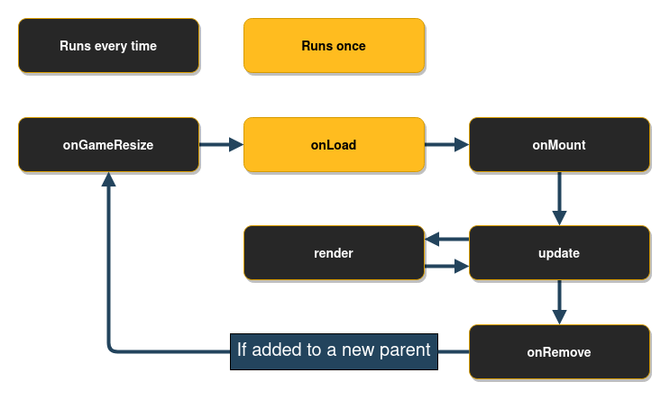

# 成分


这张图可能看起来很吓人，但别担心，它并不像看起来那么复杂。


## Component

所有组件都继承自抽象类 `Component`.

如果你想跳过阅读抽象类，你可以直接跳到 [](#positioncomponent).

每一个 `Component` 有一些你可以选择实现的方法，这些方法由 `FlameGame` 班级。如果你不使用 `FlameGame`，如果你愿意，你可以在自己的游戏循环中使用这些方法。



这 `onGameResize` 每当调整屏幕大小时调用该方法，并且在开始时通过 `add` 方法。

这 `onRemove` 可以重写方法以在从游戏中移除组件之前运行代码，即使使用父级 remove 方法和 `Component` 删除方法。

这 `onLoad` 可以重写方法以运行组件的异步初始化代码，例如加载图像。该方法在执行后 `onGameResize`, 但之前 `onMount`.该方法保证在组件的生命周期内只执行一次，因此可以将其视为“异步构造函数”。

这 `onMount` 每次将组件安装到游戏树时都会运行该方法。这意味着你不应该初始化 `late final` 这里的变量，因为此方法可能会在组件的整个生命周期中运行多次。此方法仅在父级已挂载时运行。如果父级尚未挂载，则此方法将在队列中等待（这对游戏引擎的其余部分没有影响）。

可以通过一系列 getter 检查组件生命周期状态：
 - `isLoaded`：返回具有当前加载状态的布尔值
 - `loaded`：返回组件完成加载后将完成的未来
 - `isMounted`：返回具有当前安装状态的布尔值
 - `mounted`：返回组件完成安装后将完成的未来

### 优先

在 Flame 中，渲染（和更新）组件的顺序被称为 `priority`, 这有时被称为 `z-index` 在其他语言和框架中。越高的 `priority` 设置为，组件将出现在屏幕上的距离越近，因为它将呈现在任何在其之前呈现的优先级较低的组件之上。

例如，如果你添加两个组件并将其中一个设置为优先级 1，则该组件将呈现在另一个组件之上（如果它们重叠），因为默认优先级为 0。

所有组件均采用 `priority` 作为命名参数，因此如果你在编译时知道组件的优先级，则可以将其传递给构造函数。

例子：

```dart
class MyGame extends FlameGame {
  @override
  Future<void> onLoad() {
    final myComponent = PositionComponent(priority: 5);
    add(myComponent);
  }
}
```

要更新组件的优先级，你必须将其设置为新值，例如 `component.priority = 2`, 并将在下一次更新中更新。

例子：

```dart
class MyComponent extends PositionComponent with Tappable {

  MyComponent() : super(priority: 1);

  @override
  void onTap() {
    priority = 2;
  }
}
```

在上面的示例中，我们首先将组件初始化为优先级 1，然后当用户点击组件时，我们将优先级更改为 2。


### 组件的可组合性

有时将其他组件包装在组件中很有用。例如，通过层次结构对视觉组件进行分组。你可以通过将子组件添加到任何组件来做到这一点，例如 `位置组件`.当每次更新和渲染父组件时，组件上有子组件时，所有子组件都会以相同的条件进行渲染和更新。

使用示例，其中两个组件的可见性由包装器处理：

```dart
class GameOverPanel extends PositionComponent with HasGameRef<MyGame> {
  bool visible = false;
  final Image spriteImage;

  GameOverPanel(this.spriteImage);

  @override
  Future<void> onLoad() async {
    final gameOverText = GameOverText(spriteImage); // GameOverText is a Component
    final gameOverButton = GameOverButton(spriteImage); // GameOverRestart is a SpriteComponent

    add(gameOverText);
    add(gameOverButton);
  }

  @override
  void render(Canvas canvas) {
    if (visible) {
    } // If not visible none of the children will be rendered
  }
}
```


### 查询子组件

已添加到组件中的子组件位于 `QueryableOrderedSet` 叫 `children`.要查询集合中特定类型的组件，`query<T>()` 可以使用功能。默认 `strictMode` 是 `false` 在孩子集中，但如果你把它设置为真，那么查询将不得不注册 `children.register` 在可以使用查询之前。

如果你在编译时知道稍后将运行特定类型的查询，则建议注册该查询，无论是否 `strictMode` 被设定为 `true` 要么 `false`，因为可以从中获得一些性能优势。这 `register` 通话通常在 `onLoad`.

例子：

```dart
@override
Future<void> onLoad() async {
  children.register<PositionComponent>();
}
```

在上面的示例中，注册了一个查询 `位置Component`s，以及如何查询注册的组件类型的示例如下所示。

```dart
@override
void update(double dt) {
  final allPositionComponents = children.query<PositionComponent>();
}
```


### PositionType 如果你想创建一个 HUD（平视显示器）或其他与游戏坐标无关的组件，你可以更改 `PositionType` 的组件。默认 `PositionType` 是 `positionType = PositionType.game` 并且可以更改为 `PositionType.viewport` 要么 `PositionType.widget` 取决于你要如何定位组件。

 - `PositionType.game`（默认）- 尊重相机和视口。
 - `PositionType.viewport`- 仅尊重视口（忽略相机）。
 - `PositionType.widget`- 相对于 Flutter 游戏小部件（即原始画布）坐标系的位置。

你的大多数组件可能会根据 `PositionType.game`，因为你希望他们尊重 `Camera` 和 `Viewport`.但是通常你希望按钮和文本始终显示在屏幕上，无论你是否移动相机，然后你都想使用 `PositionType.viewport`.在极少数情况下，你想使用 `PositionType.widget` 当你不希望组件尊重相机或视口时，定位你的小部件；例如，如果控件或操纵杆必须留在视口内，则可能不符合人体工程学。

请注意，仅当组件直接添加到根目录时才会遵守此设置 `FlameGame` 而不是作为另一个组件的子组件。


## PositionComponent

此类表示屏幕上的定位对象，可以是浮动矩形或旋转精灵。如果将子元素添加到其中，它还可以表示一组已定位的组件。

的基础 `PositionComponent` 是它有一个 `position`,`size` ,`scale` ,`angle` 和 `anchor` 它改变了组件的渲染方式。


### Position

这 `position` 只是一个 `Vector2` 它表示组件的锚点相对于其父项的位置；如果父母是 `FlameGame`，它与视口有关。


### 尺寸

这 `size` 当相机的缩放级别为 1.0（无缩放，默认）时组件的。这 `size` 是 *不是* 相对于组件的父级。


### 规模

这 `scale` 是组件及其子组件应缩放的程度。因为它由一个表示 `Vector2`，你可以通过更改以统一的方式缩放 `x` 和 `y` 以相同的金额，或以不统一的方式，通过更改 `x` 要么 `y` 以不同的金额。


### 角度

这 `angle` 是围绕锚点的旋转角度，以弧度表示。它是相对于父母的角度。


### 锚

这 `anchor` 是组件上应该定义位置和旋转的位置（默认为 `Anchor.topLeft`）。因此，如果你将锚点设置为 `Anchor.center` 组件在屏幕上的位置将在组件的中心，如果 `angle` 应用时，它围绕锚点旋转，因此在这种情况下围绕组件的中心旋转。你可以将其视为组件中的点，Flame 通过它“抓取”它。


### PositionComponent 子组件

的所有孩子 `PositionComponent` 将相对于父级进行转换，这意味着 `position`,`angle` 和 `scale` 将是相对于父母的状态。因此，例如，如果你想将一个子元素放置在父元素中心上方 50 个逻辑像素处，你可以这样做：

```dart
Future<void> onLoad() async {
  final parent = PositionComponent(
    position: Vector2(100, 100),
    size: Vector2(100, 100),
    anchor: Anchor.center,
  );
  final child = PositionComponent(position: Vector2(0, -50));
  await parent.add(child);
}
```

请记住，在屏幕上呈现的大多数组件都是 `PositionComponent`s，所以这种模式可以用于例如 [](#spritecomponent) 和 [](#spriteanimationcomponent) 也。


### 渲染位置组件

实施时 `render` 扩展组件的方法 `PositionComponent` 记得从左上角（0.0）渲染。你的渲染方法不应该处理你的组件应该在屏幕上渲染的位置。要处理组件的渲染位置和方式，请使用 `position`,`angle` 和 `anchor` 属性和火焰会自动为你处理其余的。

如果你想知道组件的边界框在屏幕上的哪个位置，你可以使用 `toRect` 方法。

如果你想改变组件渲染的方向，你也可以使用 `flipHorizontally()` 和 `flipVertically()` 翻转任何在画布上绘制的东西 `render(Canvas canvas)`，围绕锚点。这些方法适用于所有 `PositionComponent` 对象，并且在 `精灵组件` 和 `精灵动画组件`.

如果你想围绕其中心翻转组件而无需将锚点更改为 `Anchor.center`， 你可以使用 `flipHorizontallyAroundCenter()` 和 `flipVerticallyAroundCenter()`.


## SpriteComponent

最常用的实现 `PositionComponent` 是 `SpriteComponent`, 它可以用 `Sprite`：

```dart
import 'package:flame/components/component.dart';

class MyGame extends FlameGame {
  late final SpriteComponent player;

  @override
  Future<void> onLoad() async {
    final sprite = await Sprite.load('player.png');
    final size = Vector2.all(128.0);
    final player = SpriteComponent(size: size, sprite: sprite);

    // screen coordinates
    player.position = ... // Vector2(0.0, 0.0) by default, can also be set in the constructor
    player.angle = ... // 0 by default, can also be set in the constructor
    add(player); // Adds the component
  }
}
```


## SpriteAnimationComponent

此类用于表示具有在单个循环动画中运行的精灵的组件。

这将使用 3 个不同的图像创建一个简单的三帧动画：

```dart
final sprites = [0, 1, 2]
    .map((i) => Sprite.load('player_$i.png'));
final animation = SpriteAnimation.spriteList(
  await Future.wait(sprites),
  stepTime: 0.01,
);
this.player = SpriteAnimationComponent(
  animation: animation,
  size: Vector2.all(64.0),
);
```

如果你有一个精灵表，你可以使用 `sequenced` 构造函数来自 `SpriteAnimationData` 类（查看更多详细信息 [图像 &gt; 动画](rendering/images.md#animation)):

```dart
final size = Vector2.all(64.0);
final data = SpriteAnimationData.sequenced(
  textureSize: size,
  amount: 2,
  stepTime: 0.1,
);
this.player = SpriteAnimationComponent.fromFrameData(
  await images.load('player.png'),
  data,
);
```

如果你不使用 `FlameGame`，不要忘记这个组件需要更新，因为动画对象需要被勾选才能移动帧。


## 精灵动画组

`SpriteAnimationGroupComponent` 是一个简单的包装器 `SpriteAnimationComponent` 这使你的组件能够保存多个动画并在运行时更改当前正在播放的动画。

它的用途与 `SpriteAnimationComponent` 但该组件不是使用单个动画进行初始化，而是接收一个泛型类型的 Map`T` 作为关键和 `SpriteAnimation` 作为值和当前动画。

例子：

```dart
enum RobotState {
  idle,
  running,
}

final running = await loadSpriteAnimation(/* omitted */);
final idle = await loadSpriteAnimation(/* omitted */);

final robot = SpriteAnimationGroupComponent<RobotState>(
  animations: {
    RobotState.running: running,
    RobotState.idle: idle,
  },
  current: RobotState.idle,
);

// Changes current animation to "running"
robot.current = RobotState.running;
```


## 精灵组

`SpriteGroupComponent` 与其对应的动画非常相似，但尤其是对于精灵。

例子：

```dart
class ButtonComponent extends SpriteGroupComponent<ButtonState>
    with HasGameRef<SpriteGroupExample>, Tappable {
  @override
  Future<void>? onLoad() async {
    final pressedSprite = await gameRef.loadSprite(/* omitted */);
    final unpressedSprite = await gameRef.loadSprite(/* omitted /*);

    sprites = {
      ButtonState.pressed: pressedSprite,
      ButtonState.unpressed: unpressedSprite,
    };

    current = ButtonState.unpressed;
  }

  // tap methods handler omitted...
}
```


## SVG 组件

**笔记**: 要将 SVG 与 Flame 一起使用，请使用 [`flame_svg`](https://github.com/flame-engine/flame_svg) 包裹。

该组件使用一个实例 `Svg` 类来表示具有在游戏中呈现的 svg 的组件：

```dart
final svg = await Svg.load('android.svg');
final android = SvgComponent.fromSvg(
  svg,
  position: Vector2.all(100),
  size: Vector2.all(100),
);
```


## FlareActor 组件

**笔记**：以前使用 Flare 集成 API 的实现 `FlareAnimation` 和 `FlareComponent` 已被弃用。

要在 Flame 中使用 Flare，请使用 [`flame_flare`](https://github.com/flame-engine/flame_flare) 包裹。

这是使用的界面 [flare animation](https://pub.dev/packages/flare_flutter) 火焰之中。`FlareActorComponent` 具有与 flare 几乎相同的 API`FlareActor` 小部件。它接收动画文件名（默认加载 `Flame.bundle`)，它还可以接收一个可以播放多个动画和控制节点的 FlareController。

```dart
import 'package:flame_flare/flame_flare.dart';

class YourFlareController extends FlareControls {

  late ActorNode rightHandNode;

  void initialize(FlutterActorArtboard artboard) {
    super.initialize(artboard);

    // get flare node
    rightHand = artboard.getNode('right_hand');
  }
}

final fileName = 'assets/george_washington.flr';
final size = Vector2(1776, 1804);
final controller = YourFlareController();

FlareActorComponent flareAnimation = FlareActorComponent(
  fileName,
  controller: controller,
  width: 306,
  height: 228,
);

flareAnimation.x = 50;
flareAnimation.y = 240;
add(flareAnimation);

// to play an animation
controller.play('rise_up');

// you can add another animation to play at the same time
controller.play('close_door_way_out');

// also, you can get a flare node and modify it
controller.rightHandNode.rotation = math.pi;
```

你还可以使用 `updateAnimation` 方法。

有关工作示例，请查看 [flame_flare 存储库](https://github.com/flame-engine/flame_flare/tree/main/example).


## 视差分量

这 `Component` 可用于通过在彼此顶部绘制多个透明图像来渲染具有深度感的背景，其中每个图像或动画（`ParallaxRenderer`）以不同的速度移动。

基本原理是，当你看着地平线并移动时，较近的物体似乎比远处的物体移动得更快。

该组件模拟了这种效果，使背景效果更加逼真。

最简单的 `ParallaxComponent` 是这样创建的：

```dart
@override
Future<void> onLoad() async {
  final parallaxComponent = await loadParallaxComponent([
    ParallaxImageData('bg.png'),
    ParallaxImageData('trees.png'),
  ]);
  add(parallaxComponent);
}
```

ParallaxComponent 也可以通过实现 `onLoad` 方法：

```dart
class MyParallaxComponent extends ParallaxComponent with HasGameRef<MyGame> {
  @override
  Future<void> onLoad() async {
    parallax = await gameRef.loadParallax([
      ParallaxImageData('bg.png'),
      ParallaxImageData('trees.png'),
    ]);
  }
}

class MyGame extends FlameGame {
  @override
  Future<void> onLoad() async {
    add(MyParallaxComponent());
  }
}
```

这将创建一个静态背景。如果你想要移动视差（这是视差的全部点），你可以通过几种不同的方式来实现，具体取决于你希望为每个图层设置设置的细粒度。

他们最简单的方法是设置命名的可选参数 `baseVelocity` 和 `velocityMultiplierDelta` 在里面 `load` 辅助功能。例如，如果你想以更快的速度沿 X 轴移动背景图像，则图像“更接近”：

```dart
final parallaxComponent = await loadParallaxComponent(
  _dataList,
  baseVelocity: Vector2(20, 0),
  velocityMultiplierDelta: Vector2(1.8, 1.0),
);
```

你可以随时设置 baseSpeed 和 layerDelta，例如当你的角色跳跃或游戏加速时。

```dart
final parallax = parallaxComponent.parallax;
parallax.baseSpeed = Vector2(100, 0);
parallax.velocityMultiplierDelta = Vector2(2.0, 1.0);
```

默认情况下，图像与左下角对齐，沿 X 轴重复并按比例缩放，以使图像覆盖屏幕的高度。如果你想改变这种行为，例如如果你不制作横向卷轴游戏，你可以设置 `repeat`,`alignment` 和 `fill` 每个参数 `ParallaxRenderer` 并将它们添加到 `ParallaxLayer`s 然后传递给 `ParallaxComponent` 的构造函数。

高级示例：
```dart
final images = [
  loadParallaxImage('stars.jpg', repeat: ImageRepeat.repeat, alignment: Alignment.center, fill: LayerFill.width),
  loadParallaxImage('planets.jpg', repeat: ImageRepeat.repeatY, alignment: Alignment.bottomLeft, fill: LayerFill.none),
  loadParallaxImage('dust.jpg', repeat: ImageRepeat.repeatX, alignment: Alignment.topRight, fill: LayerFill.height),
];
final layers = images.map((image) => ParallaxLayer(await image, velocityMultiplier: images.indexOf(image) * 2.0));
final parallaxComponent = ParallaxComponent.fromParallax(
  Parallax(
    await Future.wait(layers),
    baseVelocity: Vector2(50, 0),
  ),
);
```

 - 本例中的星星图像将在两个轴上重复绘制，居中对齐
缩放以填充屏幕宽度。
 - 行星图像将在 Y 轴上重复，对齐到屏幕的左下角，而不是
缩放。
 - 灰尘图像将在 X 轴上重复，与右上角对齐并缩放以填满屏幕
高度。

完成设置后 `ParallaxComponent`，将其添加到游戏中，就像使用任何其他组件（`game.add(parallaxComponent`)）。另外，不要忘记将图像添加到 `pubspec.yaml` 文件作为资产，否则将找不到。

这 `Parallax` 文件包含游戏的扩展名，它添加了 `loadParallax`,`loadParallaxLayer` ,`loadParallaxImage` 和 `loadParallaxAnimation` 以便它自动使用你游戏的图像缓存而不是全局缓存。这同样适用于 `ParallaxComponent` 文件，但提供 `loadParallaxComponent`.

如果你想要全屏 `ParallaxComponent` 简单地省略 `size` 参数，它将占用游戏的大小，当游戏改变大小或方向时，它也会调整为全屏。

Flame 提供了两种 `ParallaxRenderer`：`ParallaxImage` 和 `ParallaxAnimation`,`ParallaxImage` 是一个静态图像渲染器和 `ParallaxAnimation` 顾名思义，它是一个基于动画和帧的渲染器。也可以通过扩展来创建自定义渲染器 `ParallaxRenderer` 班级。

三个示例实现可以在 [示例目录](https://github.com/flame-engine/flame/tree/main/examples/lib/stories/parallax).


## 形状组件

一种 `ShapeComponent` 是表示可缩放几何形状的基类。形状有不同的方式来定义它们的外观，但它们都有可以修改的大小和角度，并且形状定义将相应地缩放或旋转形状。

这些形状旨在作为一种工具，用于以更一般的方式使用几何形状，而不是与碰撞检测系统一起使用，你想在其中使用 [ShapeHitbox](collision_detection.md#shapehitbox)es。


### 多边形组件

一种 `PolygonComponent` 是通过在构造函数中给它一个点列表来创建的，称为顶点。这个列表将被转换成一个具有一定大小的多边形，它仍然可以缩放和旋转。

例如，这将创建一个从 (50, 50) 到 (100, 100) 的正方形，其中心位于 (75, 75)：
```dart
void main() {
  PolygonComponent([
    Vector2(100, 100),
    Vector2(100, 50),
    Vector2(50, 50),
    Vector2(50, 100),
  ]);
}
```

一种 `PolygonComponent` 也可以使用相对顶点列表创建，这些顶点是相对于给定大小定义的点，通常是预期父级的大小。

例如，你可以像这样创建一个菱形多边形：

```dart
void main() {
  PolygonComponent.relative(
    [
      Vector2(0.0, 1.0), // Middle of top wall
      Vector2(1.0, 0.0), // Middle of right wall
      Vector2(0.0, -1.0), // Middle of bottom wall
      Vector2(-1.0, 0.0), // Middle of left wall
    ],
    size: Vector2.all(100),
  );
}
```

示例中的顶点定义了 x 和 y 轴上从屏幕中心到边缘的长度百分比，因此对于列表中的第一项 (`Vector2(0.0, 1.0)`)，我们指向中间边界框的顶壁，因为这里的坐标系是从多边形的中心定义的。


在图像中，你可以看到由紫色箭头形成的多边形形状是如何由红色箭头定义的。

请记住以逆时针方式定义列表（如果你认为在 y 轴翻转的屏幕坐标系中，否则为顺时针方向）。


### 矩形组件

一种 `RectangleComponent` 与如何创建非常相似 `PositionComponent` 被创建，因为它也有一个边界矩形。

例如这样的事情：

```dart
void main() {
  RectangleComponent(
    position: Vector2(10.0, 15.0),
    size: Vector2.all(10),
    angle: pi/2,
    anchor: Anchor.center,
  );
}
```

Dart 也已经有了创建矩形的极好方法，该类被称为 `Rect`, 你可以创建一个火焰 `RectangleComponent` 从一个 `Rect` 通过使用 `Rectangle.fromRect` 工厂，就像设置顶点时一样 `PolygonComponent`，你的矩形将根据 `Rect` 如果你使用这个构造函数。

以下将创建一个 `RectangleComponent` 其左上角在 `(10, 10)` 和大小 `(100, 50)`.

```dart
void main() {
  RectangleComponent.fromRect(
    Rect.fromLTWH(10, 10, 100, 50),
  );
}
```

你还可以创建一个 `RectangleComponent` 通过定义与预期父级大小的关系，你可以使用默认构造函数从位置、大小和角度构建矩形。这 `relation` 是相对于父大小定义的向量，例如 `relation` 那是 `Vector2(0.5, 0.8)` 将创建一个矩形，其宽度为父尺寸的 50%，高度为 80%。

在下面的示例中 `RectangleComponent` 大小的 `(25.0, 30.0)` 定位于 `(100, 100)` 将被创建。

```dart
void main() {
  RectangleComponent.relative(
    Vector2(0.5, 1.0),
    position: Vector2.all(100),
    size: Vector2(50, 30),
  );
}
```

由于正方形是矩形的简化版本，因此还有一个用于创建正方形的构造函数 `RectangleComponent`, 唯一的区别是 `size` 论证是一个 `double` 代替 `Vector2`.

```dart
void main() {
  RectangleComponent.square(
    position: Vector2.all(100),
    size: 200,
  );
}
```


### 圆形组件

如果你知道你的圆的位置和/或半径从一开始会有多长，你可以使用可选参数 `radius` 和 `position` 设置那些。

以下将创建一个 `CircleComponent` 其中心在 `(100, 100)` 半径为 5，因此大小为 `Vector2(10, 10)`.

```dart
void main() {
  CircleComponent(radius: 5, position: Vector2.all(100), anchor: Anchor.center);
}
```

当创建一个 `CircleComponent` 与 `relative` 构造函数，你可以定义半径与定义的边界框的最短边相比有多长 `size`.

以下示例将导致 `CircleComponent` 它定义了一个半径为 40（直径为 80）的圆。

```dart
void main() {
  CircleComponent.relative(0.8, size: Vector2.all(100));
}
```


## SpriteBody 组件

看 [SpriteBody 组件](../other_modules/forge2d.md#spritebodycomponent) 在 Forge2D 文档中。


## 平铺组件

目前我们有一个非常基本的 Tiled 组件实现。此 API 使用库 [tiled.dart](https://github.com/flame-engine/tiled.dart) 解析地图文件并渲染可见层。

可以找到如何使用 API 的示例 [here](https://github.com/flame-engine/flame_tiled/tree/main/example).


## IsometricTileMapComponent

该组件允许你基于块的笛卡尔矩阵和等轴测图块集渲染等轴测图。

关于如何使用它的一个简单示例：

```dart
// Creates a tileset, the block ids are automatically assigned sequentially starting at 0,
// from left to right and then top to bottom.
final tilesetImage = await images.load('tileset.png');
final tileset = IsometricTileset(tilesetImage, 32);
// Each element is a block id, -1 means nothing
final matrix = [[0, 1, 0], [1, 0, 0], [1, 1, 1]];
add(IsometricTileMapComponent(tileset, matrix));
```

它还提供了转换坐标的方法，因此你可以处理点击、悬停、在图块顶部渲染实体、添加选择器等。

你还可以指定 `tileHeight`，这是瓷砖中每个长方体的底面和顶面之间的垂直距离。基本上，它是长方体最前面边缘的高度；通常它是图块大小的一半（默认）或四分之一。在下图中，你可以看到以较深色调着色的高度：


这是一个四分之一长度地图的示例：


Flame 的示例应用程序包含一个更深入的示例，主要介绍如何解析坐标以制作选择器。代码可以找到 [here](https://github.com/flame-engine/flame/blob/main/examples/lib/stories/tile_maps/isometric_tile_map.dart)，并且可以看到现场版本 [here](https://examples.flame-engine.org/#/Tile%20Maps_Isometric%20Tile%20Map).


## NineTileBoxComponent

九瓦盒是使用网格精灵绘制的矩形。

网格精灵是一个 3x3 的网格，有 9 个方块，分别代表 4 个角、4 个边和中间。

角以相同的尺寸绘制，边沿侧向拉伸，中间向两边展开。

使用它，你可以获得一个可以很好地扩展到任何尺寸的盒子/矩形。这对于制作面板、对话框、边框很有用。

检查示例应用程序 [nine_tile_box](https://github.com/flame-engine/flame/blob/main/examples/lib/stories/utils/nine_tile_box.dart) 有关如何使用它的详细信息。


## 自定义 PainterComponent

一种 `CustomPainter` 是一个 Flutter 类，与 `CustomPaint` 在 Flutter 应用程序中呈现自定义形状的小部件。

Flame 提供了一个组件，可以渲染一个 `CustomPainter` 叫 `CustomPainterComponent`，它接收一个自定义的 painter 并在游戏画布上渲染它。

这可用于在你的 Flame 游戏和 Flutter 小部件之间共享自定义渲染逻辑。

检查示例应用程序 [custom_painter_component](https://github.com/flame-engine/flame/blob/main/examples/lib/stories/widgets/custom_painter_component.dart) 有关如何使用它的详细信息。


## 效果

Flame 提供了一组可以应用于特定类型组件的效果，这些效果可用于为组件的某些属性设置动画，例如位置或尺寸。你可以查看这些效果的列表 [here](effects.md).

可以找到运行效果的例子 [here](https://github.com/flame-engine/flame/blob/main/examples/lib/stories/effects);
