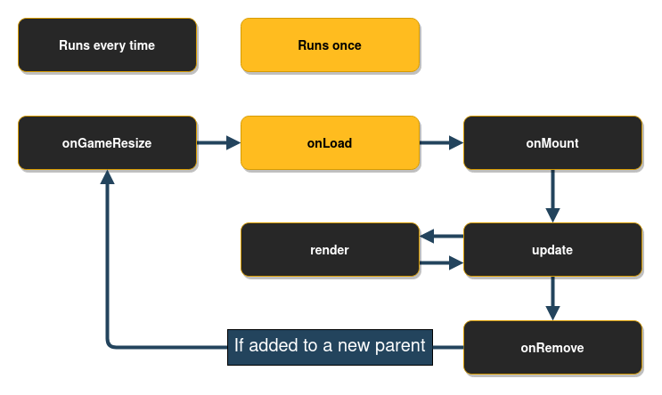
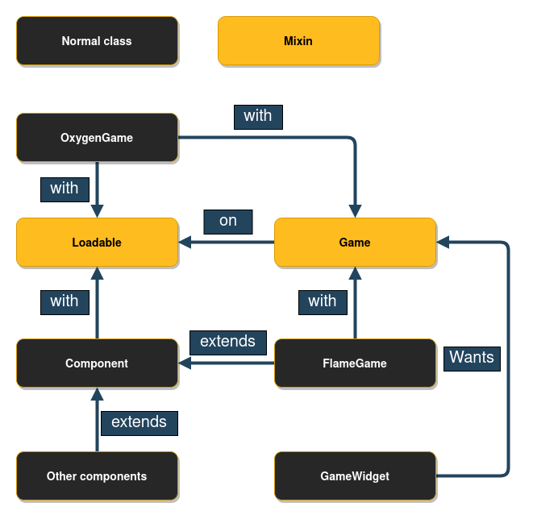

# 火焰游戏

`FlameGame` 是最基本也是最常用的 `Game` 火焰课堂。

这 `FlameGame` 类实现了一个 `Component` 基于 `Game`.基本上它有一个列表 `Component`s 并通过 `update` 和 `render` 呼吁所有人 `Component` 已添加到游戏中的 s。

我们将这个基于组件的系统称为火焰组件系统，简称 FCS。

每次需要调整游戏大小时，例如改变方向时，`FlameGame` 将调用所有的 `Component`s`resize` 方法，它还会将此信息传递给相机和视口。

这 `FlameGame.camera` 控制坐标空间中的哪个点应该是屏幕的左上角（它默认为 [0,0] 像常规 `Canvas`）。

一种 `FlameGame` 实现示例如下所示：

```dart
class MyCrate extends SpriteComponent {
  // creates a component that renders the crate.png sprite, with size 16 x 16
  MyCrate() : super(size: Vector2.all(16), anchor: Anchor.center);

  @override
  Future<void> onLoad() async {
    sprite = await Sprite.load('crate.png');
  }

  @override
  void onGameResize(Vector2 gameSize) {
    super.onGameResize(gameSize);
    // We don't need to set the position in the constructor, we can set it 
    // directly here since it will be called once before the first time it 
    // is rendered.
    position = gameSize / 2;
  }
}

class MyGame extends FlameGame {
  @override
  Future<void> onLoad() async {
    await add(MyCrate());
  }
}

main() {
  final myGame = MyGame();
  runApp(
    GameWidget(
      game: myGame,
    ),
  );
}
```

**笔记：** 如果你在构建方法中实例化你的游戏，你的游戏将在每次
Flutter 树被重建，这通常比你想要的更频繁。为避免这种情况，你可以先创建一个游戏实例，然后在你的小部件结构中引用它，就像在上面的示例中所做的那样。

从列表中删除组件 `FlameGame` 这 `remove` 要么 `removeAll` 可以使用方法。如果你只想删除一个组件，可以使用第一个，当你想删除一个组件列表时可以使用第二个。

其上的任何组件 `remove()` 方法已被调用也将被删除。你可以简单地做到这一点 `yourComponent.remove();`.


## 生命周期



当游戏首次添加到 Flutter 小部件树时，将按顺序调用以下生命周期方法：`onGameResize` ,`onLoad` 和 `onMount`.之后它继续调用 `update` 和 `render` 每个滴答声来回移动，直到从树中删除小部件。一旦 `GameWidget` 从树上移除，`onRemove` 被调用，就像从组件树中删除普通组件时一样。


## 调试模式

火焰的 `FlameGame` 类提供了一个名为的变量 `debugMode`，默认情况下是 `false`.但是，它可以设置为 `true` 启用游戏组件的调试功能。**意识到** 这个变量的值在它们被添加到游戏中时会传递给它的组件，所以如果你改变 `debugMode` 在运行时，默认不会影响已经添加的组件。

阅读更多关于 `debugMode` 关于火焰，请参阅 [Debug Docs](other/debug.md)


## 更改背景颜色

改变你的背景颜色 `FlameGame` 你必须覆盖 `backgroundColor()`.

在下面的示例中，背景颜色设置为完全透明，以便你可以看到后面的小部件 `GameWidget`.默认为不透明黑色。

```dart
class MyGame extends FlameGame {
  @override
  Color backgroundColor() => const Color(0x00000000);
}
```

请注意，在游戏运行时，背景颜色不能动态更改，但如果你希望动态更改，你可以只绘制一个覆盖整个画布的背景。


## SingleGameInstance 混合

一个可选的 mixin`SingleGameInstance` 如果你正在制作单游戏应用程序，则可以将其应用于你的游戏。这是构建游戏时的常见场景：有单个全屏 `GameWidget` 其中托管一个 `Game` 实例。

添加此 mixin 在某些场景中提供了性能优势。特别是，一个组件的 `onLoad` 方法保证在该组件添加到其父组件时启动，即使父组件本身尚未安装。所以，`await` 继续 `parent.add(component)` 保证总是完成加载组件。

使用这个 mixin 很简单：
```dart
class MyGame extends FlameGame with SingleGameInstance {
  // ...
}
```


## 底层游戏 API



这 `Game`mixin 是一个低级 API，当你想要实现游戏引擎的结构功能时可以使用它。`Game` 不实施任何 `update` 要么 `render` 例如函数。

这 `Loadable`mixin 有生命周期方法 `onLoad`,`onMount` 和 `onRemove` 在其中，从 `GameWidget`（或其他父母）当游戏加载 + 安装或删除时。`onLoad` 仅在第一次将类添加到父级时调用，但是 `onMount`（之后调用 `onLoad`) 每次添加到新父级时都会调用。`onRemove` 当类从父类中移除时调用。

**笔记**： 这 `Game`mixin 允许更自由地实现事物，但如果你使用它，你也会错过 Flame 中的所有内置功能。

一个例子 `Game` 实现可能如下所示：

```dart
class MyGameSubClass with Game {
  @override
  void render(Canvas canvas) {
    // ...
  }

  @override
  void update(double dt) {
    // ...
  }
}

main() {
  final myGame = MyGameSubClass();
  runApp(
    GameWidget(
      game: myGame,
    )
  );
}
```


## 游戏循环

这 `GameLoop` 模块是对游戏循环概念的简单抽象。基本上大多数游戏都建立在两种方法之上：

 - render 方法使用画布绘制游戏的当前状态。
 - update 方法接收自上次更新以来的增量时间（以秒为单位）并允许你移动
  到下一个状态。

这 `GameLoop` 被所有 Flame 的 `Game` 实施。


## 暂停/恢复游戏执行

火焰 `Game` 可以通过两种方式暂停和恢复：

 - 随着使用 `pauseEngine` 和 `resumeEngine` 方法。
 - 通过改变 `paused` 属性。

暂停火焰时 `Game`， 这 `GameLoop` 被有效地暂停，这意味着在恢复之前不会发生更新或新的渲染。


## Flutter 小部件和游戏实例

由于可以将 Flame 游戏包装在一个小部件中，因此很容易将其与其他 Flutter 小部件一起使用。但是，仍然有 Widgets Overlay API 让事情变得更加简单。

`Game.overlays` 使任何 Flutter 小部件都可以显示在游戏实例的顶部，这使得创建诸如暂停菜单或库存屏幕之类的东西变得非常容易。

这种管理是通过 `game.overlays.add` 和 `game.overlays.remove` 标记覆盖显示或隐藏的方法，分别通过 `String` 标识覆盖的参数。之后，可以指定哪些小部件代表 `GameWidget` 通过设置一个声明 `overlayBuilderMap`.

```dart
// Inside the game methods:
final pauseOverlayIdentifier = 'PauseMenu';

overlays.add(pauseOverlayIdentifier); // Marks 'PauseMenu' to be rendered.
overlays.remove(pauseOverlayIdentifier); // Marks 'PauseMenu' to not be rendered.
```

```dart
// On the widget declaration
final game = MyGame();

Widget build(BuildContext context) {
  return GameWidget(
    game: game,
    overlayBuilderMap: {
      'PauseMenu': (BuildContext context, MyGame game) {
        return Text('A pause menu');
      },
    },
  );
}
```

叠加层的渲染顺序由 `overlayBuilderMap`.

可以找到一个功能示例 [here](https://github.com/flame-engine/flame/blob/main/examples/lib/stories/system/overlays_example.dart).
