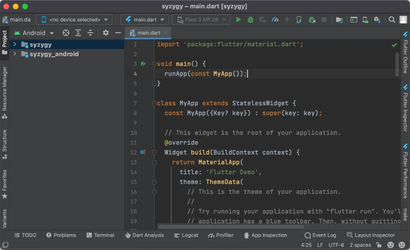
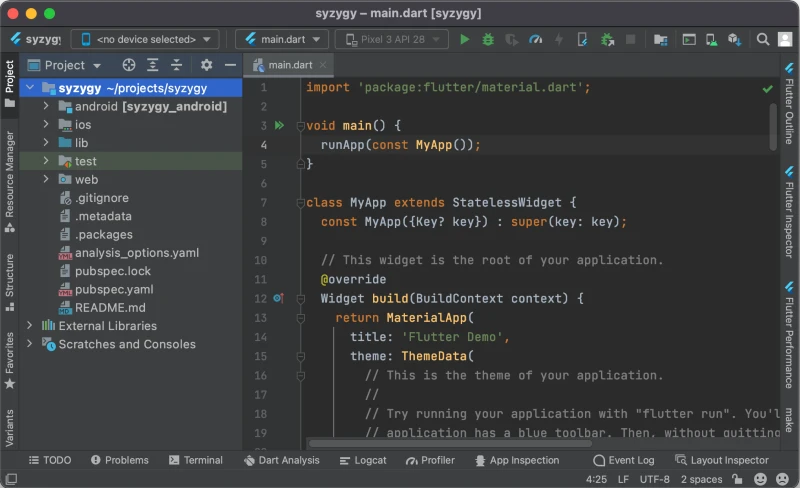

# 赤裸的火焰游戏

本教程假设你的电脑上已经有 [Flutter]、[git] 和 [Android Studio]（所有这些程序都是免费的）；并且你对使用命令行有基本的了解。Android Studio 没有严格要求，你也可以使用其他 IDE，例如 [Visual Studio Code]。


## 1. 检查颤振安装

首先，让我们验证你的 Flutter SDK 是否已正确安装并且可以从命令行访问：

```console
$ flutter doctor
[✓] Flutter (Channel stable, 2.8.0, on macOS 12.2 21D49 darwin-x64, locale en)
[✓] Android toolchain - develop for Android devices (Android SDK version 31.0.0)
[✓] Xcode - develop for iOS and macOS (Xcode 13.1)
[✓] Chrome - develop for the web
[✓] Android Studio (version 2020.3)
[✓] Connected device (1 available)
```

你的输出会略有不同，但重要的是要验证没有报错，并且你的 Flutter 版本是 **2.5.0** 或以上。


## 2. 创建项目目录

现在你需要为你的项目起一个名字。名称只能使用小写拉丁字母、数字和下划线。它还必须是有效的 Dart 标识符（例如，它不能是关键字）。

在本教程中，我将调用我的项目 **合集**，这是一个完全真实的非虚构词。

为你的新项目创建目录：

```console
$ mkdir -p ~/projects/syzygy
$ cd ~/projects/syzygy
```


## 3. 初始化空的 Flutter 项目

为了将这个贫瘠的目录变成一个实际的 Flutter 项目，运行以下命令：

```console
$ flutter create .
```
（为简洁起见，我省略了输出，但会有很多输出）。

你可以验证项目文件是否已成功创建：
```console
$ ls 
README.md               android/   lib/           pubspec.yaml   test/
analysis_options.yaml   ios/       pubspec.lock   syzygy.iml     web/
```


## 4. 在 Android Studio 中打开项目

启动 Android Studio，然后在项目选择窗口中选择 `[Open]` 并导航到你的项目目录。运气好的话，项目现在看起来像这样：



如果你只看到 `main.dart` 文件但不是侧面板，然后单击垂直 `[Project]` 窗口左边缘的按钮。

在我们继续之前，让我们修复左侧面板中的视图。找到左上角的按钮，上面写着 `[Android]` 在屏幕截图中。在此下拉列表中选择第一个选项“项目”。你的项目窗口现在应该如下所示：



重要的部分是你应该能够看到项目目录中的所有文件。


## 5. 清理项目文件

Flutter 创建的默认项目对于制作 Flame 游戏不是很有用，所以我们应该去掉它。

首先，打开文件 `pubspec.yaml` 并将其替换为以下代码（调整 `name` 和 `description` 以匹配你的项目）：

```yaml
name: syzygy
description: Syzygy flame game
version: 0.0.0
publish_to: none

environment:
  sdk: ^2.15.0

dependencies:
  flutter:
    sdk: flutter
  flame: ^1.0.0
```

之后，按 `[Pub get]` 窗口顶部的按钮；或者你可以运行命令 `flutter pub get` 从终端。这将“应用”更改 `pubspec` 文件到你的项目，特别是它将下载我们已声明为依赖项的 Flame 库。将来，你应该运行 `flutter pub get` 每当你对此文件进行更改时。

现在，打开文件 `lib/main.dart` 并将其内容替换为以下内容：

```dart
import 'package:flame/game.dart';
import 'package:flutter/widgets.dart';

void main() {
  final game = FlameGame();
  runApp(GameWidget(game: game));
}
```

最后，删除文件 `test/widget_test.dart` 完全地。


## 6. 运行项目

让我们验证一切都按预期工作，并且项目可以运行。

在窗口顶部的菜单栏中找到一个下拉菜单，上面写着 `<no device selected>`.在该下拉列表中选择 `<Chrome (web)>` 反而。

之后打开 `main.dart` 文件，然后按旁边的绿色箭头 `void main()` 第 4 行中的函数。选择 `[Run main.dart]` 从菜单中。

这应该会打开一个新的 Chrome 窗口（可能需要 10-30 秒）并在该窗口中运行你的项目。现在它只会显示一个黑屏，这是意料之中的，因为我们以最简单的空白配置创建了游戏。


## 7. 同步到 GitHub

最后一步是将你的项目上传到 GitHub。这不是必需的，但强烈推荐，因为它将作为你代码的备份。此步骤假设你已经有一个 GitHub 帐户。

登录你的 GitHub 帐户，选择 `[Your repositories]` 从你的个人资料下拉列表中，然后按绿色 `[New]` 按钮。在表单中输入与你的项目名称相同的存储库名称；选择类型“私人”；并选择不添加初始文件，如 README、许可证和 gitignore。

现在转到终端中的项目目录并执行以下命令（确保将 URL 替换为你刚刚创建的存储库的链接）：
```console
$ git init
$ git add --all
$ git commit -m 'Initial commit'
$ git remote add origin https://github.com/your-github-username/syzygy.git
$ git branch -M main
$ git push -u origin main
```

此时，如果你转到 GitHub 上的存储库页面，你将看到你的所有项目文件都在那里。


## 8. 完毕

而已！至此，你有
  - 创建了一个初始空白状态的 Flame 项目；
  - 为该项目设置 Android Studio IDE；
  - 为该项目创建了一个 GitHub 存储库。

快乐编码！


[Flutter]: https://docs.flutter.dev/get-started/install
[git]: https://git-scm.com/downloads
[Android Studio]: https://developer.android.com/studio
[Visual Studio Code]: https://code.visualstudio.com/download
